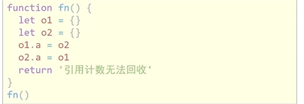
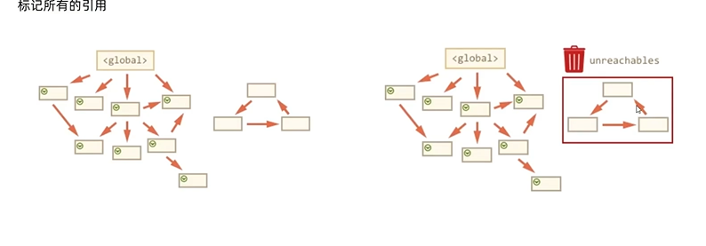

# 作用域
某个范围内不能被访问
1. 局部作用域
   1. 函数作用域
        只能函数内部声明访问const 变量，形参也是内部变量，  
        注意
        >
        函数执行完，函数内部的数据在函数执行完毕后就会回收
        >
   2. 块作用域
        大括号包裹的就是一个块,里面声明的let和const变量只能在块内访问  但是var声明的变量在块外边也能访问,var没有块级作用域  
        比如for循环  
        块之间不能相互访问  
2. 全局作用域
   写在script标签和.js文件的最外层就是全局作用域,在任意地方都可以访问  

# 作用域链
是变量的**查找机制**  
优先查找当前作用域,然后父级作用域,即就近原则
父作用域不能拿到子作用域里的变量

# 垃圾回收机制
内存的分配和回收都是自动完成的
内存生命周期
1. 内存分配
2. 内存使用
3. 内存回收

**注意**
>
1. 全局变量,一般不会回收,只有页面关闭才回收
2. 局部变量,不用的时候就会自动回收
3. 内存没有释放,就是内存泄漏
>
## 算法说明
1. 栈,简单数据,由操作系统分配回收
2. 堆,复杂数据,程序源分配,垃圾回收机制回收
回收算法
1. 引用计数法
   IE采用该方法,就是对象是否有指向他的引用,当引用为0时就回收
   缺点:
   >
   1. 嵌套引用,对象嵌套引用,无法回收
    
   >
2. 标记清除法
    
