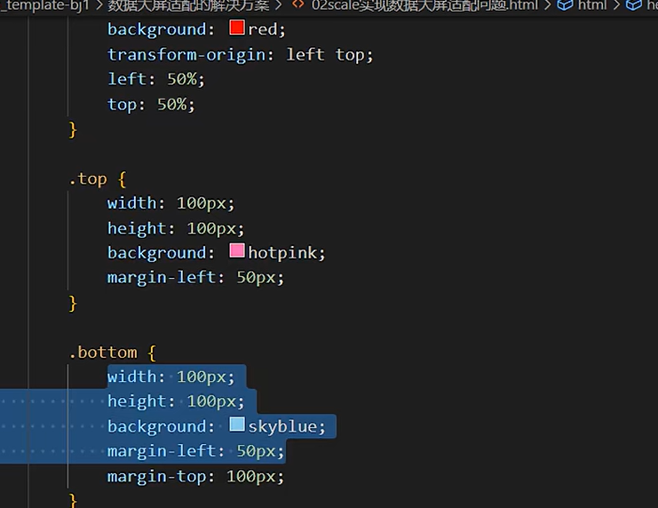
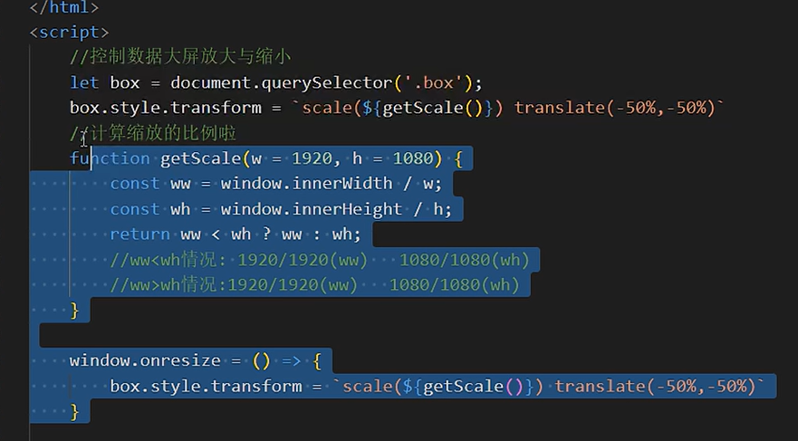

# vw vh单位解决类似rem
兼容IE8以上
```css
div{
    width:100vw;
    width:100vh;
}
.son{
    width:calc(1920 / 100vw * 20);
}
```
>缺点：文字不支持vw,vh只能支持px,导致文字会溢出，同时屏幕大小发生变化时，导致压缩问题，会与原本效果不一致，除非像变量一样自动获取窗口大小，再重新计算


# css3 transfrom scale解决
```css3
div{
    width:100vw;
    height:100vh;

}


```

