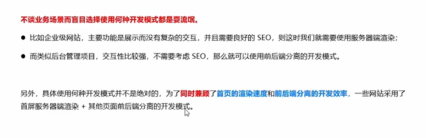

## 基于服务器渲染的Web开发模式
优点：
1. 前端耗时少
2. 有利于SEO
缺点：
1. 占用服务器资源
2. 不利于前后端分离，开发效率低
## 基于前后端分离的开发模式
依赖于AJax技术的广泛应用
优点：
1. 开发体验好
2. 用户体验好可以实现页面的局部刷新
3. 减轻了服务端的渲染压力
缺点：
1. 不利于SEO，不过利用vue，React的SSR技术可以很好的解决SEO问题

## 如何选择开发模式
根据业务场景进行选择
