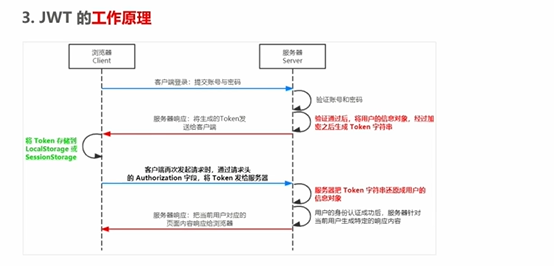

## 身份认证
基础概念：  

## 不同开发模式有不同的认证方式
1. 服务端渲染一般用Session认证机制
2. 前后端分离推荐使用JWT认证机制

## Session认证机制
**HTTP协议的无状态性**  
http每次请求都是独立的，服务器不会保留每次HTTP请求的状态  
如何突破HTTP的无状态的限制  
服务器返回一个cookie  
### 什么是cookie

键值对  
有很多属性来代表有效期，安全性
**四大特性**
1. 自动发送
2. 域名独立
3. 过期时限
4. 4kb限制

### cookie作用
当服务器将cookie发送给客户端后，客户端会自动将cookie保存在浏览器中  
浏览器会自动把cookie发送给服务器，通过请求头  

### cookie安全新
不具有安全性，浏览器也提供了读写cookie的API，因此cookie很容易伪造  
不建议将隐私数据通过cookie的形式发送给客户端

### 如何提高安全性
通过用户初始cookie+服务端认证cookie。

### Session工作原理
cookie和用户信息有对应关系

### 在Express 中 使用Session认证
首先下载express-session作为中间件安装  
然后用app.use()来注册session中间件  
配置属性 secret resave saveUninitialized  

### session认证的局限性
需要配合cookie来实现，由于Cookie默认不支持跨域访问，所以，当涉及到跨域的时候，需要很多额外的配置，才能实现跨域Session认证，比较麻烦  
## JWT认证机制
JSON Web JSON是最流行的跨域认证解决方案  
### JWT的工作原理
1. 浏览器请求登陆
2. 服务器验证通过设置加密token返回给客户端
3. 客户端将token放入locastorage
4. 客户端将token携带在请求头
5. 服务器根据token选择响应

### JWT字符串的组成部分
Header Payload Signature部分组成，分别为头部，  
三者用.号分隔  
1. Payload对于用户信息加密过后的
2. Header 和Signature是安全性相关的部分，只是为了保证Token的安全性
### 使用方式
客户端将JWT部分放在HTTP请求头的Authorization字段中
Authorization：Bearer <token>

### 在Express中使用JWT
运行命令npm install jsonwebtoken express-jwt  
jsonwebtoken用于生成JWT字符串  
express-jwt将JWT字符串解析还原成JSON对象  

