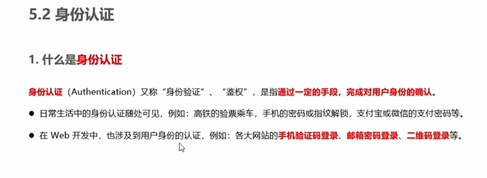
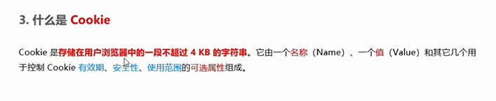
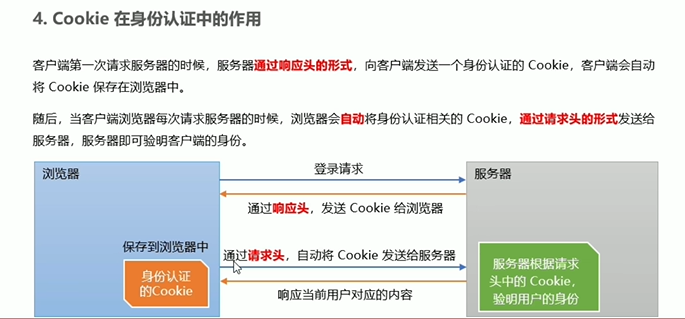
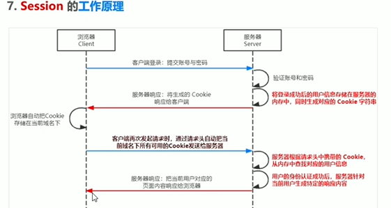

## 身份认证
基础概念：  

## 不同开发模式有不同的认证方式
1. 服务端渲染一般用Session认证机制
2. 前后端分离推荐使用JWT认证机制

## Session认证机制
**HTTP协议的无状态性**  
http每次请求都是独立的，服务器不会保留每次HTTP请求的状态  
如何突破HTTP的无状态的限制  
服务器返回一个token或cookie  
### 什么是cookie

键值对  
有很多属性来代表有效期，安全性
**四大特性**
1. 自动发送
2. 域名独立
3. 过期时限
4. 4kb限制

### cookie作用
当服务器将cookie发送给客户端后，客户端会自动将cookie保存在浏览器中  
浏览器会自动把cookie发送给服务器，通过请求头  

### cookie安全新
不具有安全性，浏览器也提供了读写cookie的API，因此cookie很容易伪造  
不建议将隐私数据通过cookie的形式发送给客户端

### 如何提高安全性
通过用户初始cookie+服务端认证cookie。

### Session工作原理
cookie和用户信息有对应关系

### 在Express 中 使用Session认证