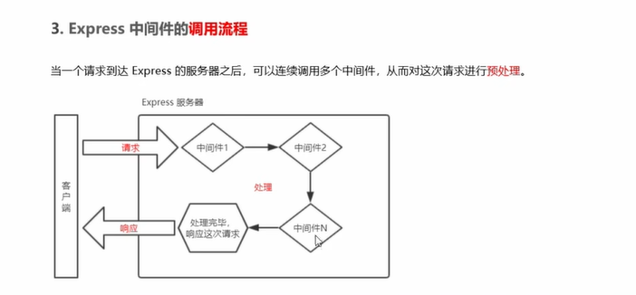
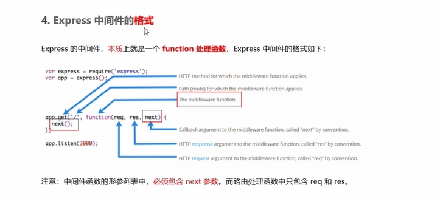
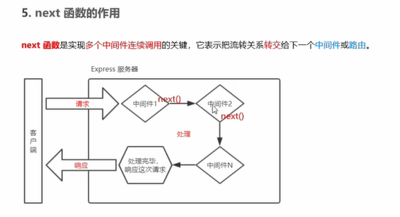
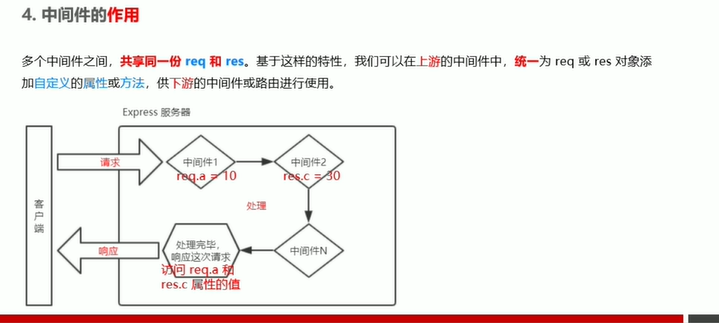
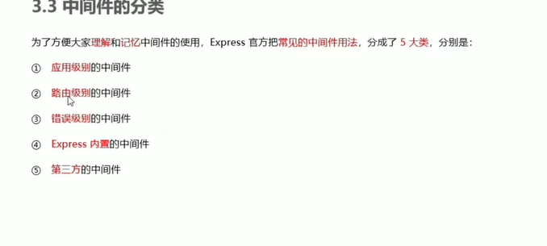
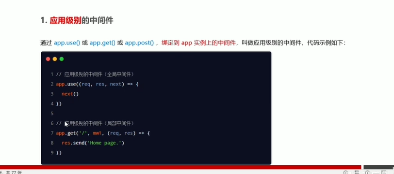
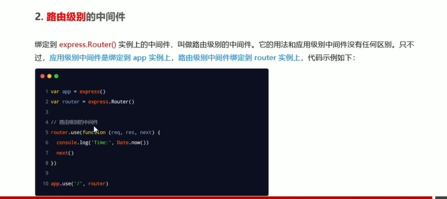
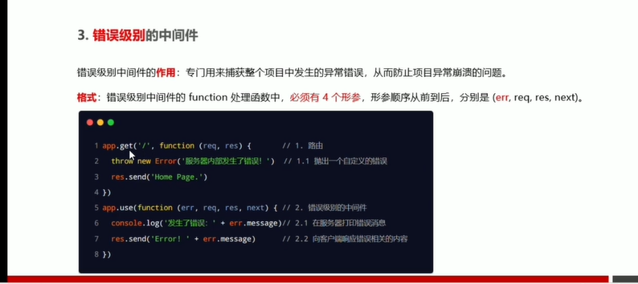

## 中间件的概念
有输入和输出，业务处理过程中的中间处理环节  
## express 中间件调用流程
请求到达服务器之后，调用多个中间件从而对请求进行预处理  

## 中间件的格式
1. 本质上是一个function处理函数  
2. 形参列表中必须有next（）函数，这与路由处理函数不同  

### next函数的作用
听起来像一个守卫  
用于实现多个中间件连续调用，将流转关系转交给下一个中间件或者路由  


## 定义中间件函数
```js
const mw=function(req,res,next){
    next();
}
```
## 中间件的作用
1. 由于共享req，res，可以在上游的中间件中挂载一些属性或方法供下游使用
   


## 中间件注意事项
> 必须在路由前注册中间件
> 执行完后必须调用next（）函数
> 防止函数混乱，调用完next（）函数之后就不要再写任何代码
> 连续调用多个中间件时共享req和res

## 中间件分类

1. 应用级别中间件
   
2. 路由级别的中间件
   绑定到router实例上的中间件
   
3. 错误级别的中间件
   用于捕获错误，从而防止项目异常崩溃的问题  
   该中间件可以再路由之后注册,最好放在所有路由的最后面
   
4. 内置中间件
   1. static快速托管静态资源
   2. express.json解析JSON格式的请求体数据
   3. express。urlencoded解析URL-encoded格式的请求体数据