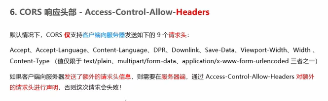
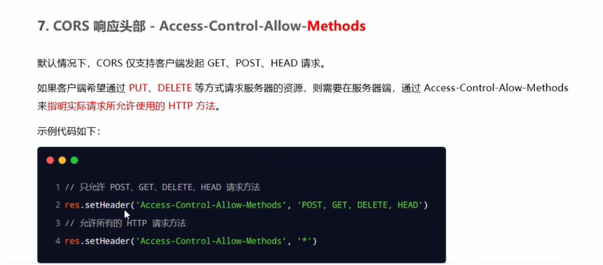
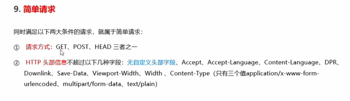
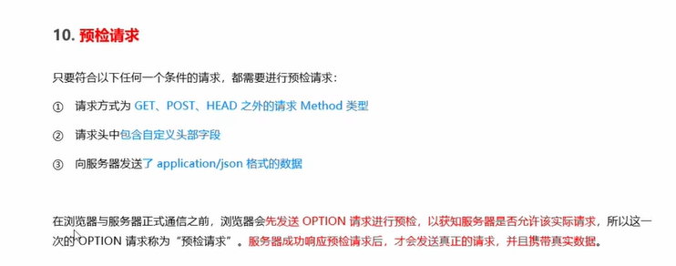
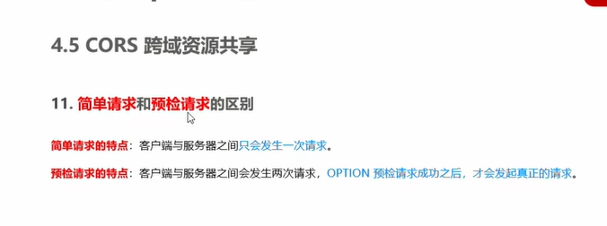
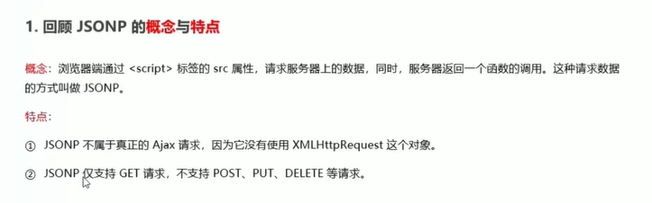
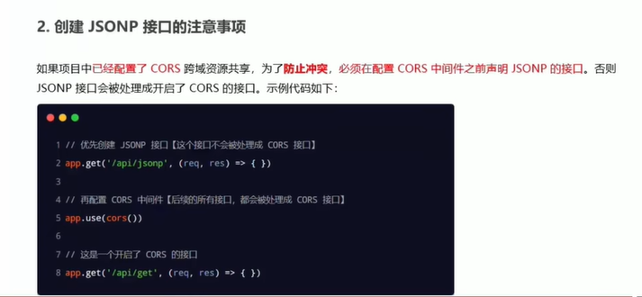
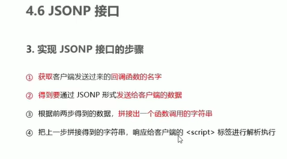
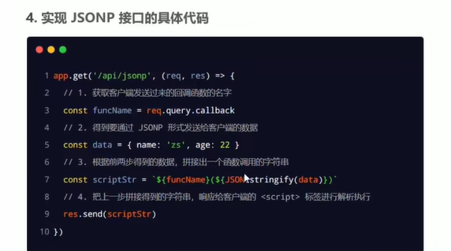

## cors跨域资源共享
**响应头**
1. Access-Control-Allow-Origin
   格式如下
   ```js
   res.setHeader('Access-Control-Allow-Origin','http://itcast.cn')
   res.setHeader('Access-Control-Allow-Origin','*')
   ```
2. Access-Control-Allow-Headers
     
    最多使用9个请求头，额外需要的必须要声明  
    ```js
     res.setHeader('Access-Control-Allow-Headers','Content-Type')
    ```
3. Access-Control-Allow-Methods
   

## cors请求分类
1. 简单请求
   
2. 预检请求
   
3. 区别
   


## JSONP接口



