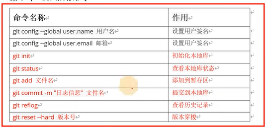
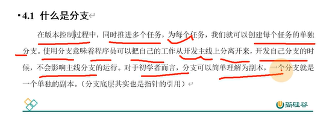
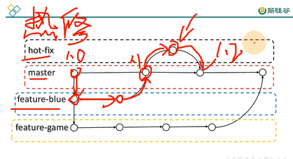
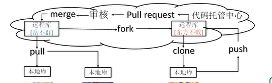

# 设置用户签名
本地设置，用于标识提交人
```
git config --global user.name ljy
git config --global user.email 3203345259@qq.com
git config --global --list    
```
# 初始化本地库
```
//让git来管理项目
git init
//查看目前状态
git status
//暂存区在.git目录里面
//git add
//git commit -m "版本信息"
//历史版本
git reflog
git log
//切换版本号
git reset --hard 版本号

```
## 分支



```


//查看分支
git branch -v
//创建分支
git branch  分支名
//切换分支
git checkout 分支名
//修改分支

//合并分支
git merge 分支名（将分支合并到当前分支）

//冲突
两个分支对于同一文件同一位置做了不同修改，必须认为决定内容  
两个分支都提交后，若有冲突的话，用vim命令解决冲突，修改代码。然后将修改后的文件重新提交  
这时提交不要带文件名
```

## git团队协作机制
**分两种**
1. 团队内协作
   团队首先
   git push 推送到远程仓库  
   其他成员  
   git clone 将远程仓库复制到本地
   其他成员修改后，再次推送（需要权限）
   git push  
   成员更新本地库
   git pull
2. 跨团队协作
   两个团队有各自的远程库  
   git fork //将A远程库插入B远程库，相当于在B中创建一个分支  
   B团队clone该分支进行开发  
   开发完成后，B团队将代码push到自己的远程库中。
   B团队发起pull request请求说明可以拉取了
   A团队审核，审核通过后将B团队的代码合并merge。
   

### 远程仓库github
部分基础代码
```
//给远程库添加别名
git remote add 别名 远程地址
//查看远程库别名
git remote -v
//代码推送到远程库
git push 别名（或者https链接） 分支名
//拉取远程库到本地 需要在同一个团队，才有权限，需要创建人给予权限
git pull 别名（或链接） 分支
//克隆远程仓库代码到本地 
克隆不需要登陆，如果远程库是公开的，任何人都可以读代码，也就是可以克隆代码  
//clone首先会拉取代码，然后初始化本地库，然后创建别名（默认为origin）
git clone 链接

```

### SSH免密登陆
添加SSH免密公钥
 ssh-keygen -t rsa -C 3203345259@qq.com


### 自建代码托管平台GitLab
用ruby语言写的

   


