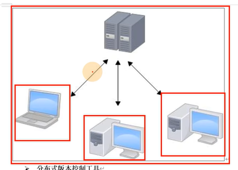
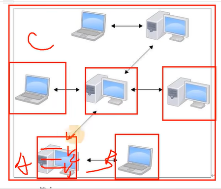

# 介绍
分布式版本控制工具
# 版本控制工具分类
1. 集中式
   >svs,svn，有一个集中式管理的服务器
   
   缺点：中央服务器的单点故障
    >

2. 分布式
   git
   

# git分区
1. 本地库--历史版本
2. 暂存区--临时存储
3. 工作区--写代码

工作区->git add->暂存区->git commit (描述)->生成历史版本

# git和代码托管中心
基于网络服务器的远程代码仓库
1. 局域网
   GitLab
2. 互联网
   GitHub
   Gitee

