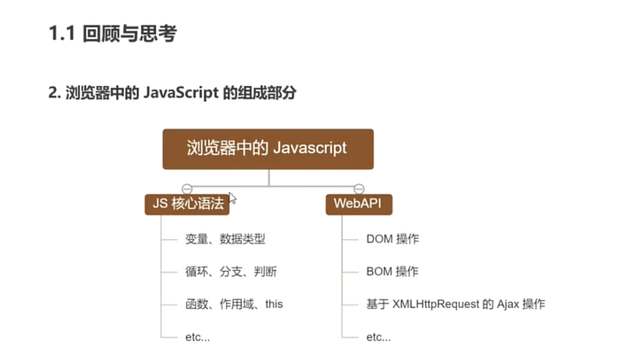
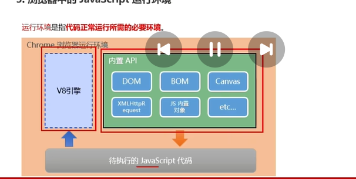
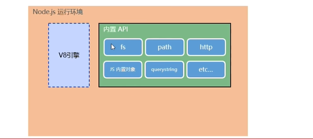
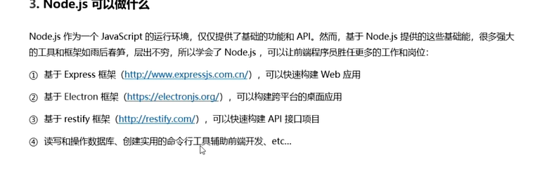

# 浏览器中的javascript组成

1. 浏览器为什么能执行js代码  
llq里面有js解析引擎  
chrome浏览器 v8  （性能最好）
>不同浏览器的解析引擎不一样
2. 为啥可以执行dom,bom,浏览器提供相关api,js可以调用
3. 浏览器中js运行环境
   每个浏览器都是运行环境,node.js也是一个运行环境（用于后端开发）  
   条件：  
   1. v8引擎
   2. Dom,Bom,xmlHttprequest请求等api,
   3. 

# nodejs定义
nodejs时js运行环境（基于V8引擎）
nodejs内置：  
1. v8引擎
2. 其他api(fs,path)(没有dom,bom那些api)

# nodejs可以做啥

1. nodejs内置api
2. 第三方Api模块，express,mysql

