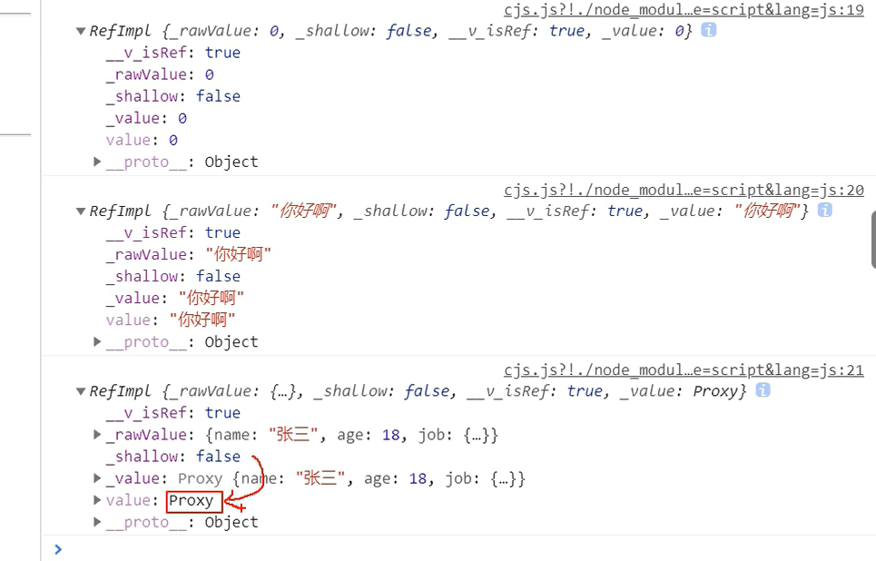
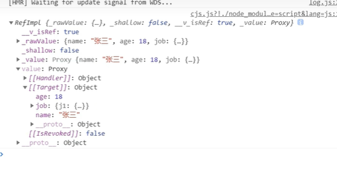

**vue3_watch**
===
与vue2不同的是可以写多个watch,   
监视ref定义的响应式对象  
```js
//监视对象，以及监视函数 
//watch是个函数，可以写多个 
//第三个参数是配置 
watch(sum,(newvalue,oldvalue)=>{
    //函数执行
}，{deep:true，immediate:true})
watch(sum2,(newvalue,oldvalue)=>{
    //监视多个对象时可以写两个watch
})

//第二种写法，监视多个对象
watch([sum,sum2],(newvalue,oldvalue)=>{
    //注意这里newvalue,oldvalue是一个数组，按照顺序，分别为监视对象的顺序
})
```
===  
监视reactive定义的响应式对象,  
1.注意：无法正确获得老数据，只能获得新数据  
2.注意：reactive对象被监视时默认加了深度监视，deep属性没用  
```js
let person=reactive({
    name:'loo',
    age:123
})
watch(person,(newvalue,oldvalue)=>{

})
```
3.不允许监视reactive对象的某一个属性，即person.name，不能直接监视监视  
```js
//例如：
watch(person.name,()=>{
    //这样无法监视到
})
//正确写法,把监视对象写成一个函数
watch(()=>{
    return person.name
},()=>{
    //4.当监视reactive里面的某一个属性时，用函数去代替时，deep会有用  
    //且oldvalue有效（里面是对象时）
}，{deep:true})
```
1：ref所定义的基本数据类型,监视时不要.value,.vlaue后拿到的时值，要监视一个变量（结构），如下图所示，  

2：ref所定义的复杂对象，如果不.value时，只有当整个对象变化时，才能监视到。因此要监视里边数据变化的话就必须要.value，或者配饰deep项


**vue2_watch**  
===   
```js
//vue3兼容该写法
watch:{
    //简写
    sum(newvalue,oldvalue){
        //sum值发生变化调用函数
    }

    //写一些配置项
    sum:{
        deep:true
        handler(newvalue,oldvalue){

        }
    }
}
```