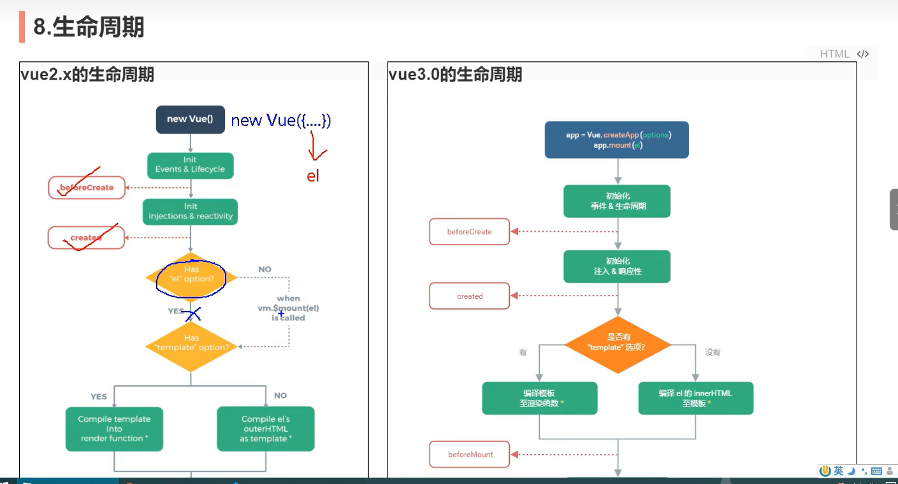
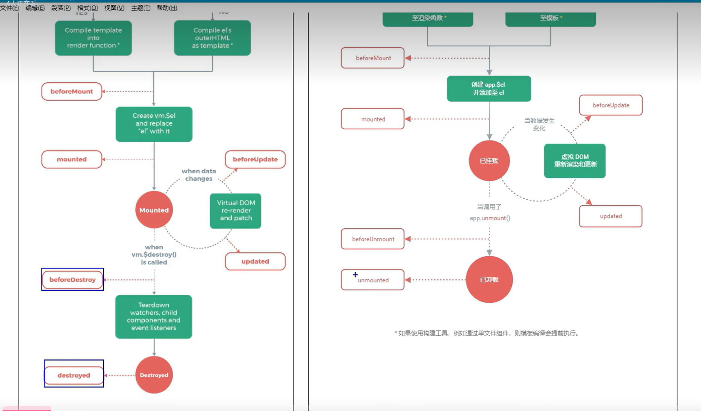

**生命周期对比**
beforeDestroyed变成了beforeUmmounted


选项式api写生命周期，完全可以这样写
```js
export defualt{
    name:"adf",
    //选项式生命周期钩子
    setup(){
        
    }
    beforeCreate(){}
    created(){}
    beforeMoute(){}
    mouted(){}
    beforeUpdate(){}
    updated(){}
    beforeUnmoute(){
    }
    unmouted(){}
    }
```

组合式api形式使用生命周期钩子  
1.注意setup是最先执行的，如果两种一起用，总是setup优先级更高
```js
import {ref,onBeforeMont} from 'vue'
export defualt{
    name:"adf",
    //选项式生命周期钩子
    setup(){
        //setup里面包含了beforeCreate和create
        //与选项式写法相比，setup执行更先
        //要先引入
        onBeforeMount(){}
        onMounted(){}
        onBeforeUpdate(){}
        onUpdated(){}
        onBeforeUnmount(){}
        onUmounted(){}
    }

}
```