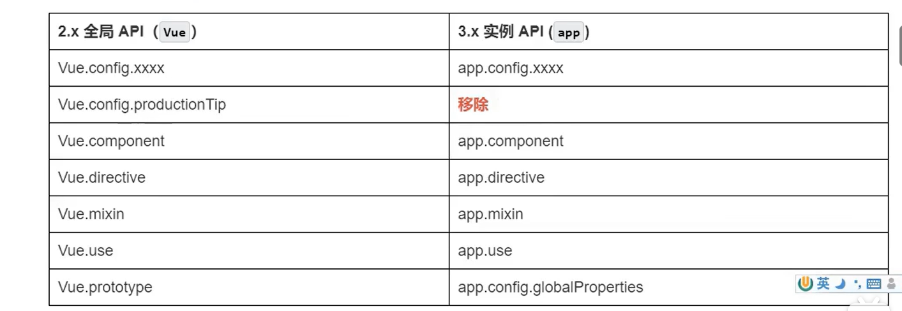

**组合式api的优势**
===
vue2中所有功能都拆散了，分布在各个配置项中（computed,methods,data）
功能多的时候，太散，很臃肿又不好维护，要打开各个配置项改动，非常不好维护   
然而vue3中把功能中的数据，方法，计算属性都可以放在一起，主要是利用了hook函数，因而叫组合式，后期能更好的维护，同时也增加了代码的复用性

**vue3的改变**
Vue身上的大部分配置都放到了app上
