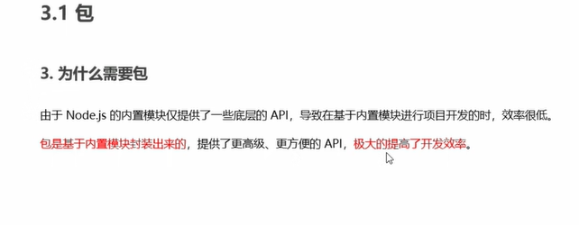
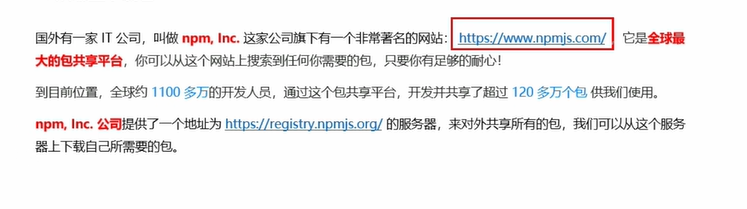
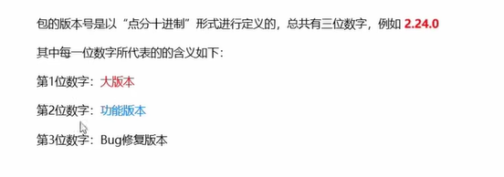
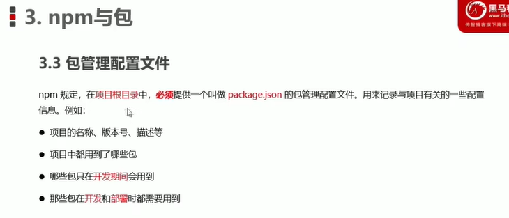
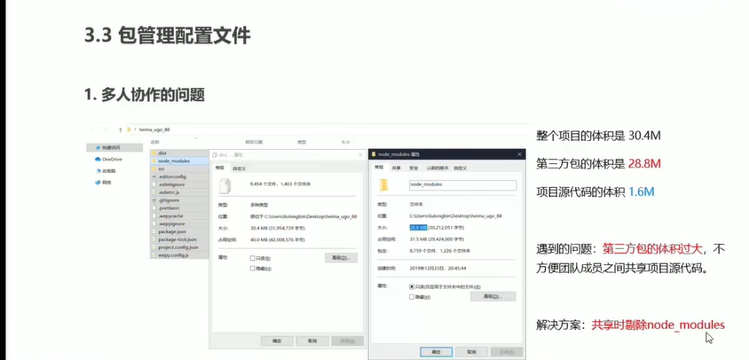
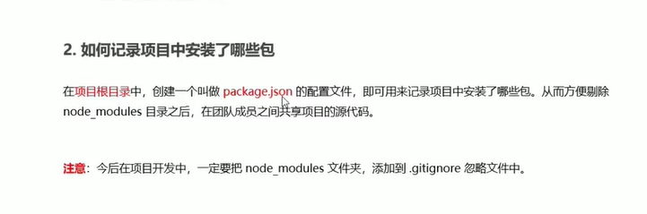
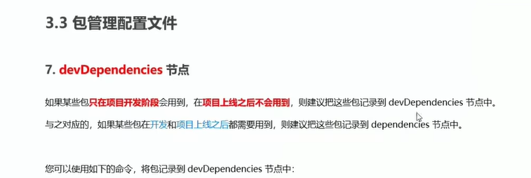
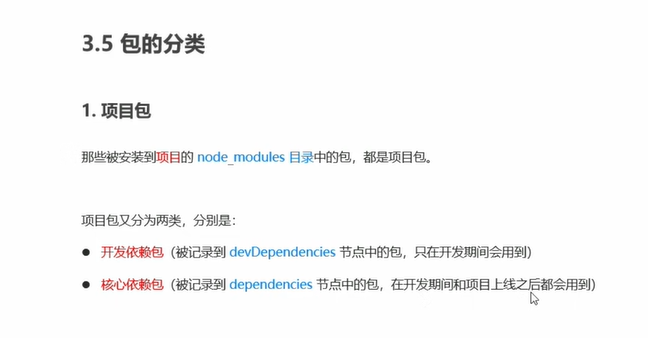
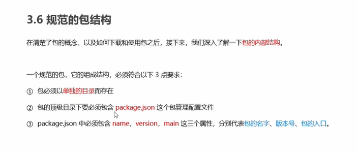

# npm与包
第三方模块与包是同一个概念，  
不同与内置模块和自定义模块  
包由第三方开发，免费使用  
## 为啥需要包
、
包是用内置模块封装出来的，提高开发效率。
## 下载来源

## 下载包
通过 npm包管理工具，安装nodejs时就安好了npm 包管理工具了。
## npm常用包

## 包的版本号
点分十进制  
第一位数字，底层重构

## 包管理配置文件
package.json

### 多人协作问题

新建一个package.json

快速创建package.json文件  
> 该命令智能在英文文件中执行

### 一次性安装所有的包
npm install 会读取package.js文件中的dependences节点

### 卸载包 
npm uninstall

这种方式是安装在开发环境下而上线后的环境就没有该包  
记录到devDependencies npm i 包名 -记录D   

### 解决npm下包速度慢的问题，因为是国外的服务器
1. 安装npm镜像服务器，同步以及提供下包的服务
2. npm config get registry检查npm下包地址
3. npm config set registry=https://registry.npm.taobao.org/
4. 安装工具nrm
5. nrm ls，查看当前可用的所有可用的镜像源
    
## 包的分类

开发类包 -D  
核心依赖包 

全局包 -g,会被安装到本机的node目录下的modules_node

## 一些包
i5ting_toc，可以把md文档给转为html页面的工具  
## 规范的包结构

## 开发属于自己的包