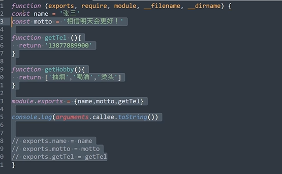

# 导入模块
```js
方法一
const school=require('./xxx.js')
//这里school是空对象
// 只有当./xxx.js文件用exports导出时才能不为空对象
方法二：结构
const {x1,x2,x3}=require('./xxx.js')
//若变量名冲突，则用es6的重命名方式
const {x1:x,x2,x3}=require('./xxx.js')
```
# 导出模块
```js
//第一种
exports.name=name
exports.slogan=slogan
exports.getTel=getTel

//第二种
module.exports={
    name,
    slogan,
}

```
**注意模块内部拿到模块对象的三种方式**
1. this
2. exports
3. module.exports

**注意！！**
>
当exports和module.exports同时使用时，最后导出的是module.exports的值  
exports是module.exports的初始引用
>


# 原理是啥
把所写的代码包含在了一个函数里面

exports，require，module，__filename,__dirname都是函数的参数，从外面传进来的

# 在浏览器
用不了commonjs的导入规则，因为那个函数实在node环境下包并运行的。
而在浏览器里，并没有这样一个函数，会报错，无法解析require
可以通过npm安装一个包browserify -g来在浏览器中使用commonjs的模块化规则，用browserify命令将文件编译，然后引入编译后的文件，就可以在浏览器环境下运行