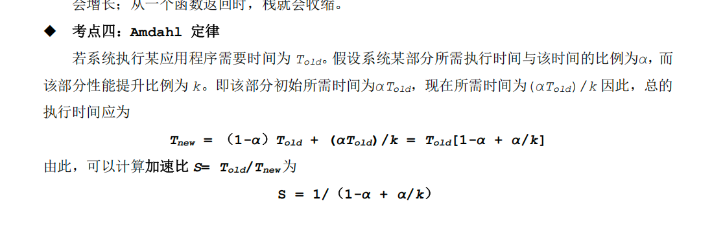

## 第一章
### 选择题
1. c
2. a
3. d
4. c
5. b
6. a
7. b
### 填空题
1）.c++ -> 预处理（cpp）-> .i -> 编译（ccl）-> .s（汇编程序文本） -> 汇编（as）-> .o（可重定位目标程序） -> 链接（ld）-> .exe(可执行)
2）.I/O设备；主存和磁盘I/O设备；处理器，主存储器和io设备

### 简答题

2=1/0.2+0.8/x  
0.4+1.6/x=1  
1.6/x=0.6  
x=3/8  

## 第二章
### 选择题
1. A
2. B
3. A
4. A
5. B (不确定)-D
6. C
7. D（不确定）-C
8. C-D
9. B A
10. D -B
11. 0.125 0.375 0.12 0.38 D
12. B@
13. @C
14. @C
15. @C
16. @B
17. @C
18. @D
19. A
20. @C
21. @C
22. A
23. A
24. A
25. B