# 指令 #

定义：
指令是计算机运行的最小功能单位，由操作码和地址码组成  
>注意：另外一台计算机只能执行自己指令系统中的指令不能执行其他的

---
## 操作码

用户要干嘛：加减乘除

## 地址码

表明用户操作对象的地址，找到这个对象，根据这个的数量可以对指令进行分类

---
### 零地址指令

不需要操作数，空操作指令，停机，关中断。

堆栈型计算机：
部分情况是有操作数的，不过隐含了，类似于求后缀表达式
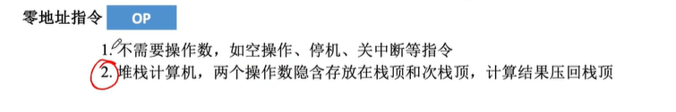

### 一地址指令

1. 只要单操作数，加一，减一取反。
>步骤：步骤，取出指令，读取地址码找到数，写入结果（原来去除的地方）。三次访存

2. 需要两个，但是其中一个在某个寄存器中
两次访存

### 二地址指令 三地址指令

两个数相加等等

四次访问存储。
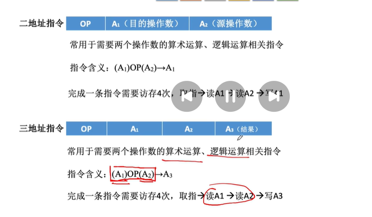

### 四地址指令

前面部分和三一样，多一个pc指向最后一个地址所指向的位置
如图：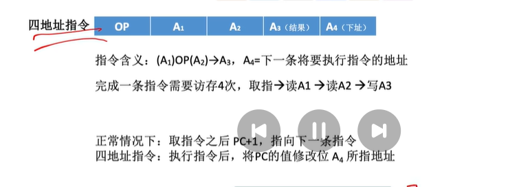

---
## 指令长度分类

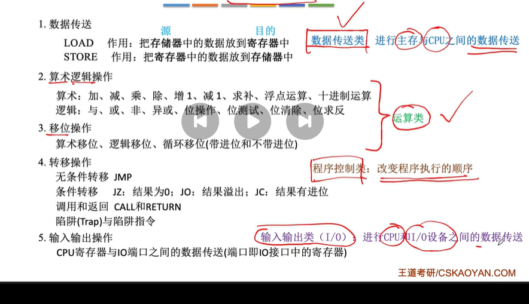
指令字长的长度会影响取指令的时间

>定长指令字结构
定长操作码，可变长操作码
>可变长指令字结构
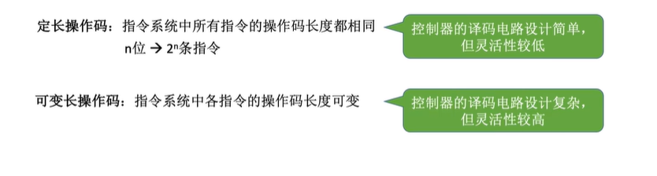

### 按操作类型分类

## 数据传送

## 算数逻辑操作

## 移位操作

## 转移操作

## 输入输出操作

# 扩展操作码格式：
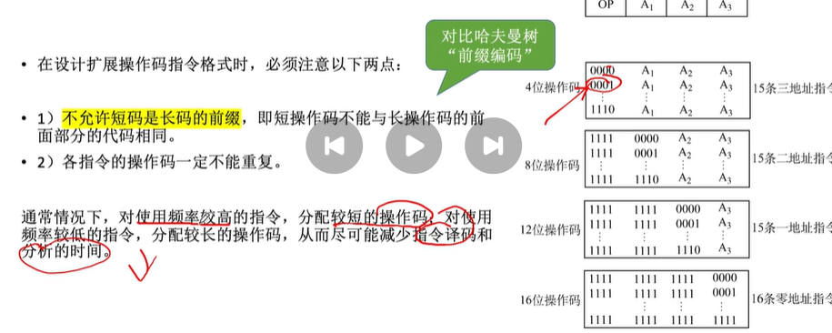

# 指令寻址
探讨下一条指令的指令地址

1. 顺序寻址
   
   每次+一个指令字长，让指令顺序执行
2. 跳跃寻址

    无条件转移指令，类似goto,pc变为一个不顺序的值
    
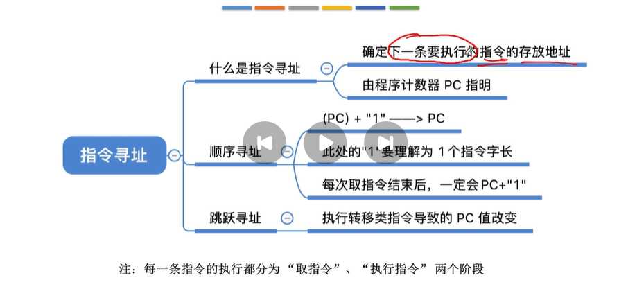，

---

# 数据寻址
确定本条指令的地址码指明的真实存储位置
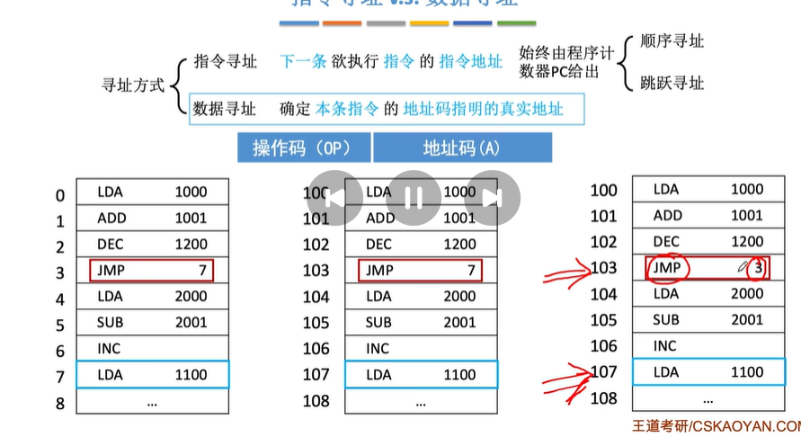

地址码的几种寻址方式：
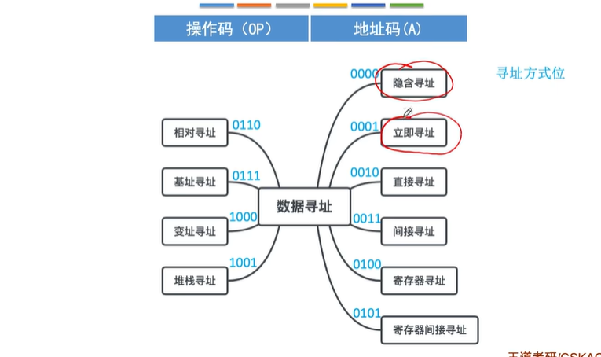
四个比特来表示使用什么方式找寻真实地址

## 直接寻址
地址码直接指向真实地址。
取数指令：  
共访存两次
>缺点：寻址范围不大。

## 间接寻址
三次访存，
地址码指向另外一个地址，这个地址指向真正的数据  
>n次间接寻址，可以扩大寻址范围，缺点：导致效率变低

## 寄存器寻址
指向寄存器的编号，一次方寸，寄存器不需要访存
>优点：指令字存短，执行快

## 寄存器间接寻址
找到的寄存器里不是真正而是一个主存地址，因此两次访存。
>特点：比一般的间接寻址速度更快。

## 隐含寻址
另一个操作数隐含在寄存器中
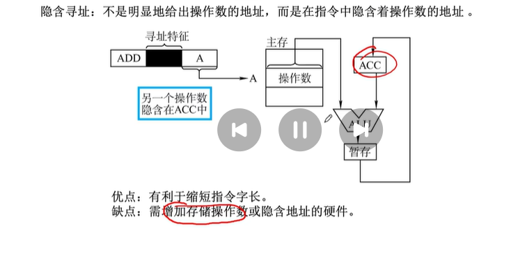

## 立即寻址
用#表示立即寻址标识操作数包含在指令中，一般采用补码，访存一次
限制数值所能表示的范围

## 偏移寻址
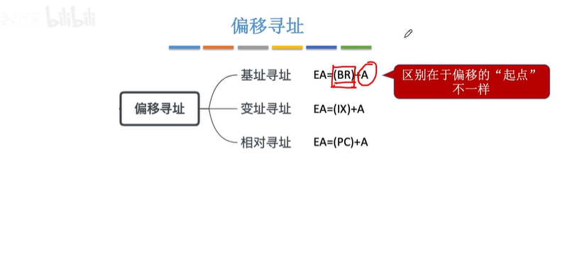
### 基址寻址
BR基址寄存器（或者通用寄存器）  
EA有效地址

